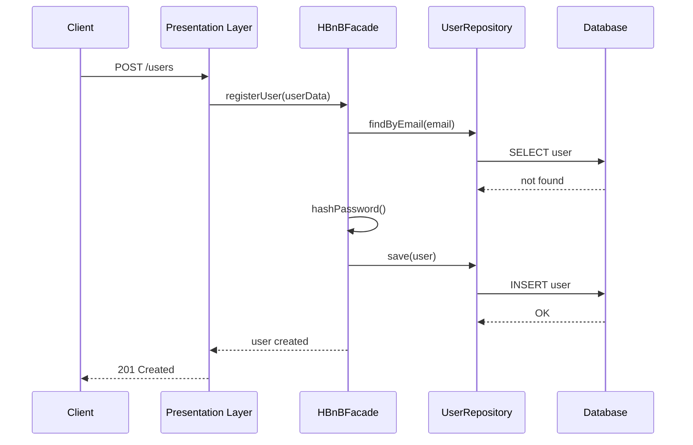

# TASK 2 — Sequence Diagrams for API Calls

This section presents sequence diagrams illustrating the interaction flow between the Presentation Layer, Business Logic Layer (HBnBFacade), and Persistence Layer for the main API use cases of the HBnB Evolution application.

The goal of these diagrams is to clearly demonstrate how API requests are processed step by step across the system layers, following the layered architecture defined in TASK 1 and the domain model defined in TASK 0.

---

## 2.1 User Registration — POST /users

### Description
This API call handles the registration of a new user. The system validates the submitted data, checks for duplicate email addresses, hashes the password, and persists the user information.

### Flow Summary
- The client sends a registration request to the API.
- The API validates the input and forwards the request to the HBnBFacade.
- The facade enforces business rules and checks email uniqueness.
- The user is saved using the UserRepository.
- A success response is returned to the client.

### Sequence Diagram

2.2 Place Creation — POST /places
Description

This API call allows a registered user to create a new place listing and optionally associate amenities with it.

Flow Summary

The client submits place data to the API.

The API forwards the request to the HBnBFacade.

The facade validates the owner and place attributes.

The place is stored and amenities are linked.

The created place is returned to the client.

Sequence Diagram
sequenceDiagram
    participant Client
    participant API as Presentation Layer
    participant Facade as HBnBFacade
    participant PlaceRepo as PlaceRepository
    participant AmenityRepo as AmenityRepository
    participant DB as Database

    Client->>API: POST /places
    API->>Facade: createPlace(placeData)
    Facade->>Facade: validateOwner()
    Facade->>PlaceRepo: save(place)
    PlaceRepo->>DB: INSERT place
    DB-->>PlaceRepo: OK
    Facade->>AmenityRepo: linkAmenities(place, amenities)
    AmenityRepo->>DB: INSERT relations
    DB-->>AmenityRepo: OK
    Facade-->>API: place created
    API-->>Client: 201 Created

