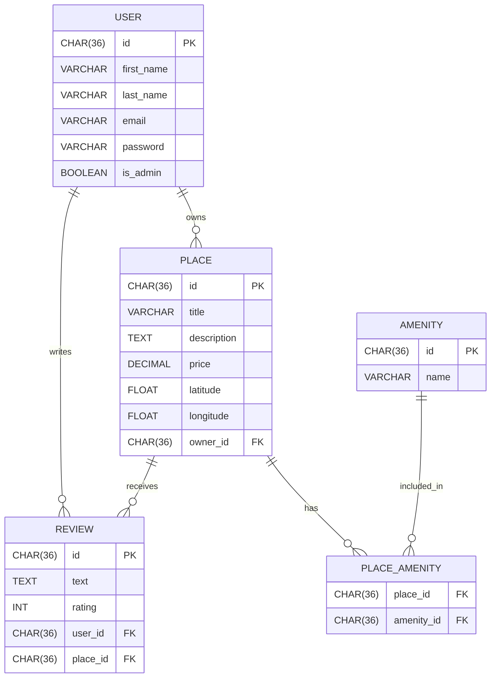

# HBnB — Database ER Diagram (Task 10)

## ER Diagram (Mermaid)

## Relationships
# One-to-Many

# USER → PLACE: one user can own zero or many places
# FK: PLACE.owner_id → USER.id

# USER → REVIEW: one user can write zero or many reviews
# FK: REVIEW.user_id → USER.id

# PLACE → REVIEW: one place can have zero or many reviews
# FK: REVIEW.place_id → PLACE.id

# Many-to-Many

# PLACE ↔ AMENITY via PLACE_AMENITY
# FKs:
# PLACE_AMENITY.place_id → PLACE.id
# PLACE_AMENITY.amenity_id → AMENITY.id

# Cardinality Symbols (Mermaid)
# Symbol	Meaning
`	
`o	`
}o	Zero or more
`}	`
