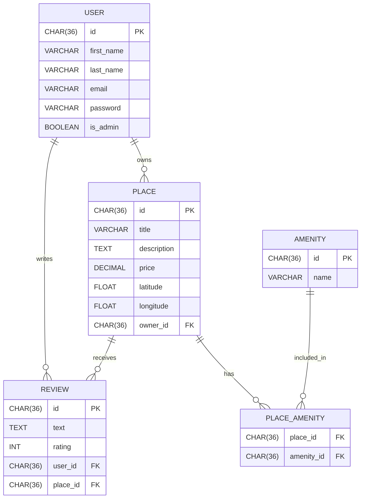

Relationships
One-to-Many Relationships
USER → PLACE: A user can own multiple places, but each place has one owner

Cardinality: ||--o{ (one to zero or many)
Foreign Key: PLACE.owner_id references USER.id
USER → REVIEW: A user can write multiple reviews, but each review is written by one user

Cardinality: ||--o{ (one to zero or many)
Foreign Key: REVIEW.user_id references USER.id
PLACE → REVIEW: A place can have multiple reviews, but each review belongs to one place

Cardinality: ||--o{ (one to zero or many)
Foreign Key: REVIEW.place_id references PLACE.id
Many-to-Many Relationship
PLACE ↔ AMENITY: A place can have many amenities, and an amenity can belong to many places
Cardinality: }o--o{ (many to many)
Junction Table: PLACE_AMENITY
Foreign Keys:
PLACE_AMENITY.place_id references PLACE.id
PLACE_AMENITY.amenity_id references AMENITY.id
Cardinality Symbols
Symbol	Meaning
||	Exactly one
o|	Zero or one
}|	One or more
}o	Zero or more
Viewing the Diagram
Online Editor: Mermaid Live Editor
GitHub: Automatically renders Mermaid diagrams in markdown files