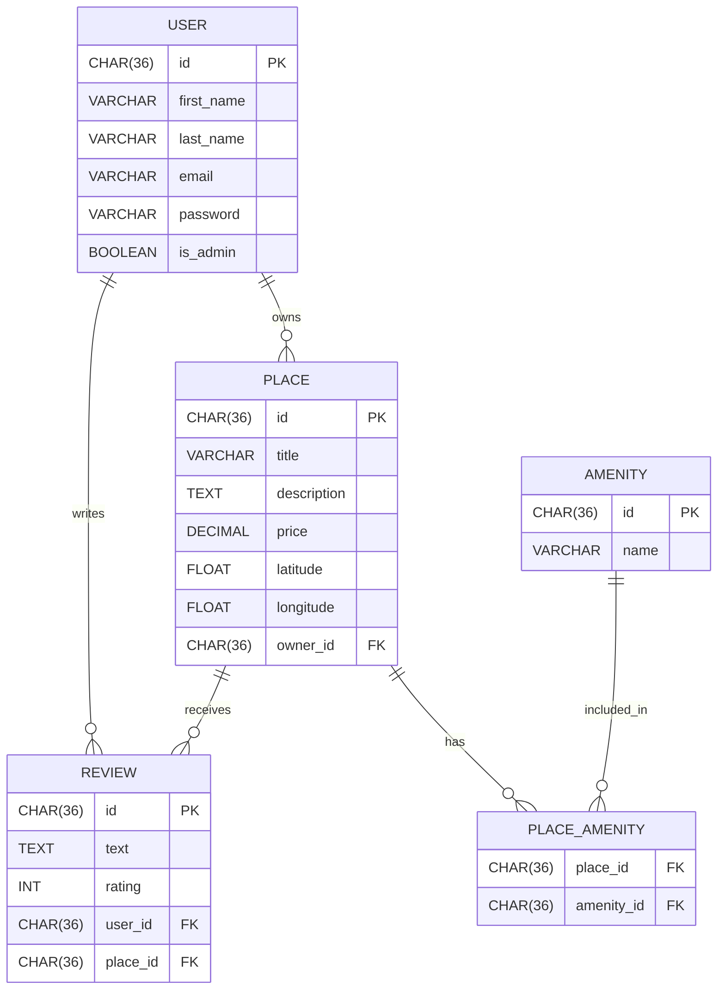

```
🔗 Relationships
One-to-Many
From	To	Meaning
USER → PLACE	A user can own many places	
USER → REVIEW	A user can write many reviews	
PLACE → REVIEW	A place can have many reviews	
Many-to-Many
Tables	Description
PLACE ↔ AMENITY	A place can have many amenities, and an amenity can belong to many places via PLACE_AMENITY
```
📘 Cardinality Symbols

| Symbol | Meaning      |             |             |
| ------ | ------------ | ----------- | ----------- |
| `      |              | `           | Exactly one |
| `o     | `            | Zero or one |             |
| `}     | `            | One or more |             |
| `}o`   | Zero or more |             |             |
